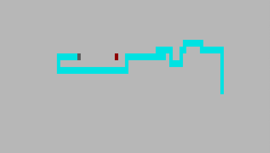
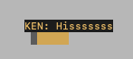

# Snake Client Project

Snake is a very popular video game. It is a video game concept where the player maneuvers a dot and grows it by ‘eating’ pieces of food. As it moves and eats, it grows and the growing snake becomes an obstacle to smooth maneuvers. The goal is to grow it to become as big as possible without bumping into the side walls, or bumping into itself, upon which it dies.

This is simply a multiplayer take on the genre.

Before you can run this client, you will need to be running the server side which you can download and install from [here](https://github.com/lighthouse-labs/snek-multiplayer).

## Final Product

*The start screen.*

*A game well underway!*

## Getting Started

- Follow steps inside the [snek server repo](https://github.com/lighthouse-labs/snek-multiplayer) to run the server side.
- (Optional) Change the "playerName" variable in __constants.js__ to your own 3-letter initial.
- Run the development snake client using the `node play.js` command.
- Play! Use the node terminal as your input. Refer to controls below.

## Controls

### Movement

The primary movement controls are W, A, S, and D. Press the respective key to move the snake in the intended direction.

Note: The snake can not make a turn in the opposite direction of its current facing.

| Key | Action |
| :-: | :----: |
|  W  |   Up   |
|  A  |  Left  |
|  S  |  Down  |
|  D  | Right  |

### Messages

This snake client comes with several pre-programmed messages that will be displayed to other connected players. Press the respective key to display the message above the player's snake.

| Key |    Action    |
| :-: | :----------: |
|  Q  |  "Gnarly!"   |
|  E  |   "Nice!"    |
|  F  |   "Funny!"   |
|  G  | "Good Game!" |
|  H  | "Hisssssss"  |

### Quit

Press CTRL + C to terminate the node process and disconnect the client.

|  Key   |  Action   |
| :----: | :-------: |
| Ctrl+C | Exit Game |
